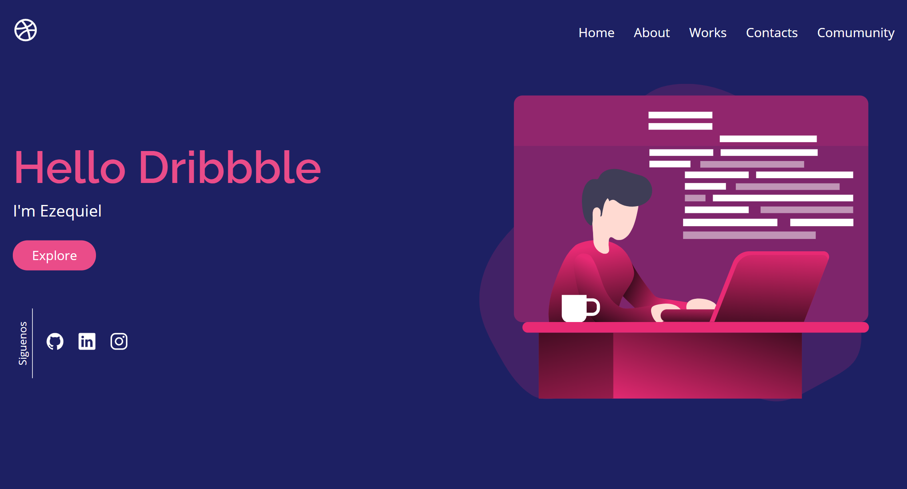

# Landing Page - Hello Dribbble

This is a one page website built to practice HTML, CSS and Javascript.

## Table of contents

- [Overview](#overview)
  - [Screenshot](#screenshot)
  - [Links](#links)
- [My process](#my-process)
  - [Built with](#built-with)
  - [Continued development](#continued-development)
- [Author](#author)

## Overview

### Screenshot

### Links

- Live Site URL: [https://ezequielsan.github.io/pagina-web-responsiva-mobile-first](https://ezequielsan.github.io/pagina-web-responsiva-mobile-first)

## My process

### Built with

- Semantic HTML5 markup
- CSS custom properties
- Flexbox
- CSS Grid
- Mobile-first workflow

### Continued development

After a long time without studying web development, I plan to resume my studies in the area, and throughout the learning process I intend to develop more projects.

## Author

- Frontend Mentor - [ezequielsan](https://www.frontendmentor.io/profile/ezequielsan)

